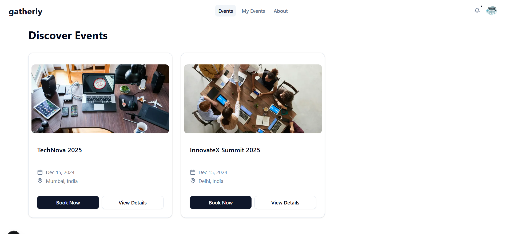

# 🎉 Gatherly

<div align="center">
  
  
</div>

<div align="center">
  <h3>🎪 Modern Event Management & Ticketing Platform</h3>
  <p>A full-stack event management application built with Next.js 14, TypeScript, and MongoDB. Create events, manage bookings, and discover local experiences with a clean, modern interface.</p>
  <p><strong>🌐 Live Demo:</strong> <a href="https://gatherly.r2k.dev">gatherly.r2k.dev</a></p>
</div>

---

## 📋 Table of Contents

- [🌟 Features](#-features)
- [🛠️ Tech Stack](#️-tech-stack)
- [📱 Screenshots](#-screenshots)
- [🚀 Getting Started](#-getting-started)
- [📁 Project Structure](#-project-structure)
- [🔧 API Endpoints](#-api-endpoints)
- [🌐 Real-World Usage](#-real-world-usage)
- [🤝 Contributing](#-contributing)
- [📄 License](#-license)

---

## 🌟 Features

### 👥 For Attendees

- **Event Discovery**: Browse and discover local events
- **Secure Booking**: Book tickets with real-time availability and confirmation
- **User Dashboard**: Manage profile, view booking history, and track events
- **Clean UI**: Modern, responsive design with shadcn/ui components

### 🎭 For Organizers

- **Event Creation**: Create detailed events with multiple ticket types
- **Image Upload**: Upload event banners via Supabase integration
- **Booking Management**: Track ticket sales
- **Role-based Access**: Organizer-specific features and permissions

### 🔐 Authentication & Security

- **NextAuth Integration**: Secure credential-based authentication
- **Email Verification**: OTP-based account verification with Resend
- **Role Management**: Attendee and organizer role separation
- **Form Validation**: Comprehensive validation with Zod and React Hook Form

---

## 📋 Development Status

> **Note**: This is a portfolio project focused on showcasing full-stack development skills and modern web technologies. Some features like notifications are UI-only components to demonstrate interface design.

### ✅ Completed Features

- **Authentication System**: Complete NextAuth setup with credentials provider
- **User Management**: Registration, login, email verification with Resend
- **Event Creation**: Full event management with image upload via Supabase
- **Booking System**: Ticket booking with real-time availability
- **Database Design**: MongoDB with Mongoose ODM for all models
- **Form Handling**: React Hook Form integration across all forms
- **UI Components**: Clean, responsive design with shadcn/ui and Tailwind CSS
- **Role-based Access**: Organizer vs attendee permissions and routing

### � In Progress

- **Payment Integration**: Stripe/PayPal integration for secure transactions
- **User Reviews**: Event rating and review system
- **Ticket Management**: Cancellation and refund functionality
- **Account Settings**: Password change and profile management

### � UI-Only Features

- **Notification Menu**: Interface component without backend implementation (focus was on core functionality)

---

## 🛠️ Tech Stack

### Frontend

<div align="center">
  
  
  
  
  
</div>

### Backend & Database

<div align="center">
  
  
  
</div>

### Authentication & Validation

<div align="center">
  
  
  
  
</div>

### Cloud Services

<div align="center">
  
  
  
</div>

---

## 📱 Screenshots

### 🏠 Homepage

<div align="center">
  
  <p><em>Modern landing page with hero section and responsive design</em></p>
</div>

---

## 🚀 Getting Started

### Prerequisites

- Node.js 18.x or later
- npm or yarn
- MongoDB Atlas account
- Supabase account (for image uploads)
- Resend account (for email verification)

### Installation

1. **Clone the repository**

   ```bash
   git clone https://github.com/riteshkrkarn/gatherly.git
   cd gatherly
   ```

2. **Install dependencies**

   ```bash
   npm install
   # or
   yarn install
   ```

3. **Set up environment variables**
   Create a `.env.local` file in the root directory:

   ```env
   MONGODB_URL=your_mongodb_atlas_connection_string
   NEXTAUTH_SECRET=your_nextauth_secret
   NEXTAUTH_URL=http://localhost:3000

   # Supabase (for image uploads)
   NEXT_PUBLIC_SUPABASE_URL=your_supabase_url
   NEXT_PUBLIC_SUPABASE_ANON_KEY=your_supabase_anon_key
   SUPABASE_SERVICE_ROLE_KEY=your_supabase_service_role_key

   # Resend (for email verification)
   RESEND_API_KEY=your_resend_api_key

   # Stripe (for payments - optional)
   STRIPE_PUBLISHABLE_KEY=your_stripe_publishable_key
   STRIPE_SECRET_KEY=your_stripe_secret_key
   ```

4. **Run the development server**

   ```bash
   npm run dev
   # or
   yarn dev
   ```

5. **Open your browser**
   Navigate to [http://localhost:3000](http://localhost:3000)

---

## 📁 Project Structure

```
gatherly/
├── src/
│   ├── app/                 # Next.js 14 App Router
│   │   ├── (auth)/         # Authentication routes
│   │   ├── api/            # API routes
│   │   ├── events/         # Event pages
│   │   └── dashboard/      # User dashboard
│   ├── components/         # Reusable UI components
│   │   ├── ui/            # shadcn/ui components
│   │   └── custom/        # Custom components
│   ├── lib/               # Utility functions
│   │   ├── dbConnect.ts   # Database connection
│   │   └── auth.ts        # Authentication config
│   ├── models/            # MongoDB models
│   │   ├── User.model.ts  # User schema
│   │   ├── Event.model.ts # Event schema
│   │   └── Booking.model.ts # Booking schema
│   ├── schemas/           # Zod validation schemas
│   │   ├── signupValidationSchema.ts
│   │   └── eventValidationSchema.ts
│   └── types/             # TypeScript type definitions
├── public/                # Static assets
├── .env.local            # Environment variables
├── package.json
└── README.md
```

---

## 🔧 API Endpoints

### Authentication

- `POST /api/auth/sign-up` - User registration
- `POST /api/verify-code` - Email verification
- `GET /api/check-username-unique` - Check username availability

### Events

- `GET /api/get-events` - Get all events with pagination
- `GET /api/events/[id]` - Get single event details
- `POST /api/create-event` - Create new event (organizers only)

### Bookings

- `POST /api/book-ticket/[id]` - Book event tickets

### Users

- `POST /api/update-user` - Update user profile

## 🌐 Real-World Usage

### 🎭 Event Organizers

- **Local Businesses**: Restaurants hosting wine tastings, cafes organizing book clubs
- **Educational Institutions**: Universities hosting seminars, workshops, and conferences
- **Community Groups**: Local clubs organizing meetups, charity events, and fundraisers
- **Entertainment Venues**: Concert halls, theaters, and comedy clubs selling tickets

### 🎪 Event Attendees

- **Professionals**: Finding networking events, conferences, and skill-building workshops
- **Students**: Discovering educational seminars, career fairs, and campus events
- **Families**: Finding family-friendly activities, festivals, and community events
- **Enthusiasts**: Booking tickets for hobby-related events, sports, and entertainment

### 💼 Business Applications

- **Corporate Events**: Company meetings, team building activities, and product launches
- **Non-profits**: Fundraising events, awareness campaigns, and volunteer activities
- **Government**: Public meetings, town halls, and community engagement events

---

## 🤝 Contributing

This is a portfolio project for showcasing full-stack development skills and learning modern web technologies. Contributions are welcome!

### Ways to Contribute

1. **Bug Reports**: Found a bug? Open an issue with detailed information
2. **Feature Requests**: Have an idea? Create a feature request
3. **Code Contributions**: Fork the repo and submit a pull request
4. **Documentation**: Help improve the documentation

### Development Guidelines

1. Follow TypeScript best practices
2. Use the established project structure
3. Write descriptive commit messages
4. Test your changes thoroughly
5. Update documentation as needed

---

## 📄 License

This project is licensed under the MIT License - see the [LICENSE](LICENSE) file for details.

---

## 🙏 Acknowledgments

- **Next.js Team** for the amazing framework
- **Vercel** for hosting and deployment
- **MongoDB** for the database solution
- **shadcn/ui** for the beautiful UI components
- **Open Source Community** for the incredible tools and libraries

---

<div align="center">
  <p>⭐ Star this repository if you find it helpful!</p>
</div>

---

## 📞 Contact

- **X**: [riteshkrkarn](https://x.com/riteshkrkarn)
- **LinkedIn**: [riteshkrkarn](https://linkedin.com/in/riteshkrkarn)

---

_This project is actively being developed. Check back for updates and new features!_
